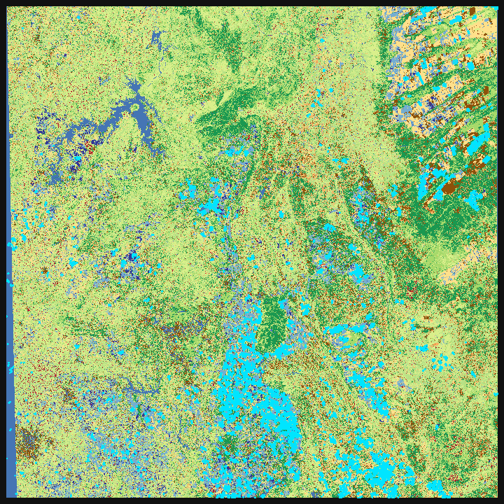

# TSA — Time Series Annotator

[](https://github.com/osmarluiz/ts-annotator/actions/workflows/ci.yml)
[](https://www.python.org/)
[](LICENSE)

**Label satellite image time series on the map, with the model in the loop.**

You click a pixel on a gigapixel scene, its yearly curve appears beside the map, you
give it a name, and the same window trains on what you have labelled, tells you where
to look next, and paints the resulting classification back over the imagery. One
environment, no exporting between tools.



---

## The gap this fills

Labelling a time series needs two things at once. You have to *see how a pixel behaves
across a season*, because a second cropping cycle is a shape and not a colour, and you
have to *find that pixel* on a scene far larger than any screen.

Existing tools solve one at a time.

| | temporal curve | gigapixel map | model in the loop |
|---|:---:|:---:|:---:|
| Temporal interpretation (TimeSync, Collect Earth Online) | yes | partly | no |
| Programmatic SITS packages (R `sits`) | yes | no | yes |
| General-purpose labellers (CVAT, Label Studio) | no | partly | partly |
| **TSA** | **yes** | **yes** | **yes** |

The loop is the point. Labelling improves the model, the model proposes where the next
label is worth placing, and the classification updates without leaving the window.

---

## What it does

1. **Reads gigapixel scenes in real time.** Overview pyramids, windowed reads and a
   tiled cache. Tested on 89,388 × 101,248 pixels per date, four bands, twelve dates.
2. **Shows the curve and the image together.** Click a pixel, see its trajectory band
   by band next to the map.
3. **Labels by keystroke.** Classes are cards. One location carries one label, enforced
   by the store rather than by the interface, so a session cannot end with two
   contradictory labels on the same field.
4. **Lets the taxonomy change while you work.** Rename, merge, remove and group classes
   under a parent. Points already collected follow the change, so you can train at the
   fine level, the coarse level, or a mixture, without collecting anything again.
5. **Finds shapes you did not plan for.** Samples the curves of a region, groups them,
   and lets you descend the result. Any group can be painted over the map, promoted to
   a class, or used to propose points.
6. **Searches by example.** Use any curve as a query and rank the work area by distance
   to it, so a shape noticed once can be found everywhere it repeats.
7. **Proposes where to look next.** Ranks candidates by confidence, margin, entropy,
   disagreement, similarity or novelty, and picks a batch with spatial and feature
   diversity, so ten suggestions are not ten pixels of the same field.
8. **Trains in the window.** An InceptionTime-style temporal CNN over the reflectance
   bands plus NDVI, under stratified grouped cross-validation on spatial clusters, so a
   held-out point is not the neighbour of a training point.
9. **Ranks your labels by how likely each is to be wrong.** Confident-learning scores
   from the out-of-fold probabilities.
10. **Has an attribute table.** Sortable and filterable, in the sense a GIS user expects,
    except the columns include what the model thinks and how suspect each label is.
    Selecting a row moves the map and draws the curve.
11. **Classifies an area.** Current view, a drawn rectangle, grid cells, or the whole
    scene. Large jobs run in the background, report progress, and resume.
12. **Versions everything.** Every model and every classification traces back to the
    exact weights and the exact labelled state that produced it.

---

## Install

```bash
git clone https://github.com/osmarluiz/ts-annotator
cd ts-annotator
pip install -e .
```

Python 3.11+, PyQt6, rasterio, PyTorch. A GPU is optional for labelling and worth
having for training.

## Try it without any data

A generator writes a synthetic twelve-month cube, so you can exercise the whole loop,
labelling, training and classification included, with nothing to download.

```bash
python examples/make_demo_project.py
tsa examples/demo_project
```

## Run the tests

```bash
python examples/make_demo_project.py   # the controller tests need the demo project
pytest -q                              # 107 tests, headless
```

---

## A project is a folder

No database and no application state to migrate. A project is a directory you can copy,
diff, archive, or put under version control.

```
project/
  project.yaml          the grid, the dates, the band names
  annotations/          the labelled points, one self-contained JSON
  models/it_v1/         weights, normalisation, class list, manifest
  models/it_v2/         the next run, never overwriting the previous
  predictions/          one sparse GeoTIFF per model, plus its sidecar
```

### The points

One JSON file. Each point records its row and column, its class, its period, how it was
obtained, and its projected coordinates when a transform is available, so the file can
be read without the imagery. The curve is stored next to the label, rounded to four
decimals, which is what lets the table, the similarity engine and the trainer work
without touching a raster again.

Every write is atomic, through a temporary file replaced into place, so an interrupted
session leaves the previous state intact rather than a truncated file. A point keeps a
stable identifier through updates, so an undo restores it exactly as it was.

### Model and prediction versioning

Training never overwrites. Each run writes `models/it_vN/` with the weights, the
normalisation, the class list, and a manifest holding the hyper-parameters, the
cross-validation metrics including per-class F1 and the confusion matrix, the number of
points, the date, **a hash of the annotation state used**, and the SHA-1 of the weight
file.

The annotation hash covers the identifier, position and class of every point, sorted,
and deliberately excludes the curves, which are derived from position. Change one label,
add a point or remove one, and the hash changes. Comparing two models is reading two
manifests.

Each classification raster carries a sidecar naming the model file that produced it, the
class-to-index mapping, and the tiles already done, which is what makes a job resumable.
A model's identity is the checksum of its weight file rather than its path or its
timestamp, so it survives being copied between machines. **If the model is retrained the
sidecar no longer matches and the raster resets rather than extends**, so a prediction
file can never become a mixture of two models.

The chain is closed at both ends. Any map traces back to the exact weights, and those
weights trace back to the exact labelled state behind them.

---

## Citing

If this tool is useful in your work, please cite it. See `CITATION.cff`.

A methods paper describing TSA has been submitted to *MethodsX*. This README will carry
the reference once it is available.

## Licence

MIT. See `LICENSE`.

The imagery used to develop and validate the tool is commercially licensed and is not
redistributed here, and neither are the labelled points derived from it. The synthetic
demo project exists so the method can be exercised end to end without any restricted
data.
